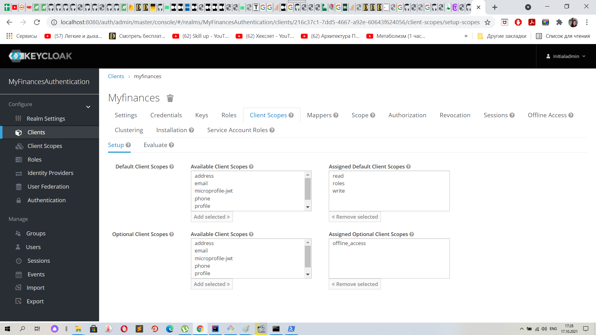
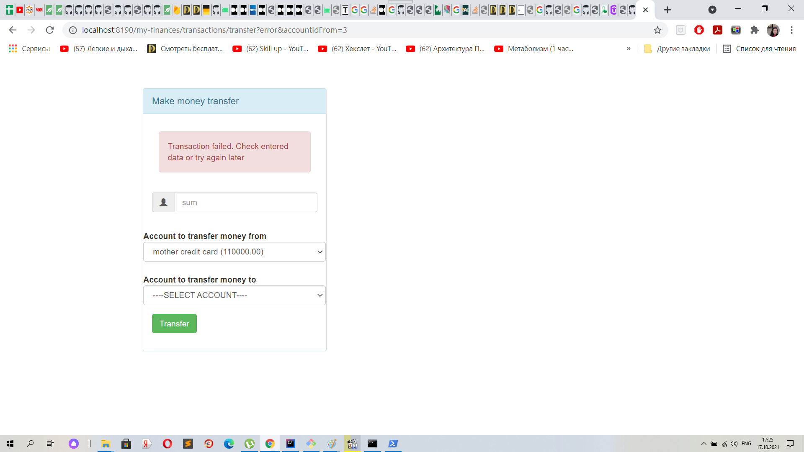

Мультимодульный проект Java Web на базе REST API, имитирующий приложение 
для просмотра финансовых счетов пользователя и перевода денежных средств с одного счета на другой
=================================================================================================

Данный проект представляет собой учебный проект по Java Web с использованием Postgres СУБД, целью которого является создание элементарного приложения для просмотра финансовых счетов пользователя и перевода денежных средств с одного счета на другой.
Проект начинается с небольшого консольного приложения, затем добавляется создание классов слоя dao, service и view с классами-фабриками данных классов, далее добавляя Spring Framework, сервлеты, web контроллеры, Hibernate, SpringBoot и SpringSecurity, завершая все мультимодульным проектом, включающим в себя модуль с общими классами, config server, discovery client, web-клиент и resource server.

[multi-module-project](https://github.com/icelier/java_my_finances_app)
Окончательный вариант проекта на текущий момент (см. Дальнейшее развитие проекта) 

### config-server
Сервер конфигурации, файлы application.properties для трех профилей default, dev, prod подключаются с удаленного git-репозитория

### eureka-service
Discovery client для определния адреса модулей

### commons-service
Модуль с общими классами (DTO и т.д.)

### finances-service
Сервер ресурсов с данными по счетам и транзакциям счетов пользователя> использует jwt для авторизации

### myfinances-client
Клиент агента пользователя, подлкючается к серверу ресурсов по web client, отображает все view

### Сервер аутентификации
В качестве сервера аутентификации использовался standalone KeyCloak Sever (на Wildfly), выпускающий токен для доступа клиента по коду авторизации, с подключением Custom User Provider (модуль users-service)

Настройки realm сервера аутентификации:

 

Добавляем клиенту myfinances mapper для username, чтобы доставать из токена:


Добавляем клиенту myfinances scopes read и write, которые используем в проекте как уровни доступа клиента:



Для запуска standalone KeyCloak сервера аутентфикации в Windows используем команду в командной строке директории {keycloak_home_directory}/bin:
```
.\standalone.bat
```

### Custom User Provider для Keycloak сервера
Модуль users-service в виде jar-файла со всеми зависимостями размещается в директории {keycloak_home_directory}/standalone/deployments 

Настройки custom user provider в KeyCloak:


## Последовательное развитие проекта:

Lesson 1-5: [spring-framework-stage](https://github.com/icelier/java_my_finances_app/tree/lesson_5_spring_base)
Добавлены слои dao, service, view, классы-фабрик синглтонов данных классов, подключение к базе данных Postgres с помощью прямого подключения от data source, внедрение SpringFramework.
Использовались система контроля миграций базы данных Liquibase, Hikari dataSource
Ветки для более ранних стадий проекта опущены в силу их малой показательности. 

Lesson 6: [spring-framework+servlets-stage](https://github.com/icelier/java_my_finances_app/tree/lesson_6_servlets)
Добавлены классы сервлетов. Для развертывания в Tomcat на IntelliJ IDEA Community Edition использовался tomcat7-maven-plugin 

Lesson 7: [spring-framework-servlets+controllers-stage](https://github.com/icelier/java_my_finances_app/tree/lesson_7_controllers)
Добавлены классы контроллеров. 

Lesson 8: [spring-framework-servlets-controllers+hibernate-stage](https://github.com/icelier/java_my_finances_app/tree/lesson_8_hibernate)
Проект переведен на использование Hibernate. 

Lesson 9: [spring-framework-servlets-controllers-hibernate+spring-boot-stage](https://github.com/icelier/java_my_finances_app/tree/lesson_9_spring_boot)
Перевод проекта на Spring Boot.  

Lesson 10: [spring-framework-servlets-controllers-hibernate-spring-boot+spring-security-stage](https://github.com/icelier/java_my_finances_app/tree/lesson_10_spring_security)
Добавление Spring Security в проект с аутентификацией пользователя через UserDetailsService. 

[master](https://github.com/icelier/java_my_finances_app/tree/master)
Мастер-ветка со всеми уроками

## Внешний вид проекта

    

## Дальнейшее развитие проекта

Ближайшие цели для данного проекта: 

- тестирование проекта 
- перевести сервер аутентификации на встроенный (модуль проекта) KeyCloak сервер взамен standalone
- реализовать User Registration Provider в KeyCloak сервере для добавления новых пользователей
- внести исправление в сервер конфигураций для обновления файлов конфигураций удаленного git-репозитория при работающем сервере конфигураций
- добавить маршрутизатор GateWay
- добавить Message Bundle для отображения на разных языках
- перевести на Docker

## Для проекта использовалось:
- база данных PostgreSQL, схема по умолчанию - finances
Для проекта необходимо создать схему `finances` в psql, чтобы она изначально могла проинициализироваться Liquibase:
```
CREATE SCHEMA finances;
```


